# 使用 VS Code 偵錯 Angular 程式

本文使用 VS Code v1.71.2 為 Angular 設定偵錯

* 第 1 步：創建一個 Angular 應用程式
* 第 2 步：為 Chrome 安裝偵錯器（您可以安裝其他您喜歡的偵錯器）
* 第 3 步：組態偵錯環境
* 第 4 步：開始偵錯

## 第 1 步 - 創建一個 Angular 應用程式
 
我們使用 Angular CLI 創建專案，

安裝 Angular CLI：

```
npm install -g @angular/cli
```

創建一個新的 Angular 應用程式

```
ng new my-app
```

切換到應用程式目錄

```
cd my-app
```


使用 VS Code 打開目前的目錄

```
code .
```

## 第 2 步 - 為 Chrome 安裝偵錯器
 
在 VS Code 環境中：左鍵單擊管理（左下角）> Extensions（或 Ctrl+Shift+X） 

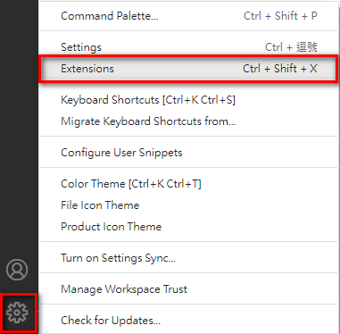
 
此時左方側欄會打開 Extensions 檢視面版。然後在搜尋框中輸入`chrome`。您將看到擴充套件： `Debugger for Chrome`。

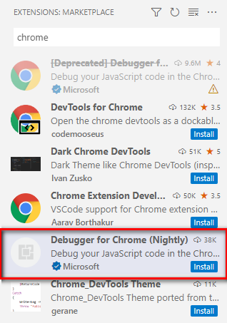

按 Debugger for Chrome 的 Install 按鈕 
 
## 第 3 步 - 組態偵錯環境

在新建 Angular 專案後，若已新增 `.vscode\launch.json` 檔案(檔案內容如下畫面)，可略過此步驟。

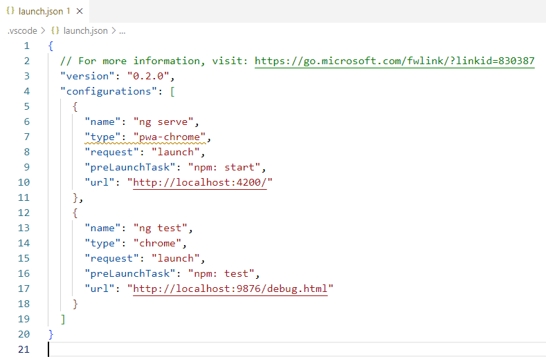

> 註： `preLaunchTask` 屬性表示偵錯前要執行的指令，所以上圖的組態表示不需要自行輸入 `ng serve -o` 命令來執行應用程式。

在 VS Code 環境下：點擊左側的 Run and Debug 按鈕（或 Ctrl+Shift+D） 

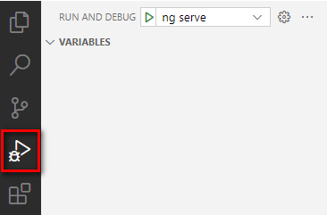


如果尚未組態執行和偵錯（尚未創建 `launch.json` 檔案），VS Code 會顯示 RUN AND DEBUG: RUN 初始檢視
 
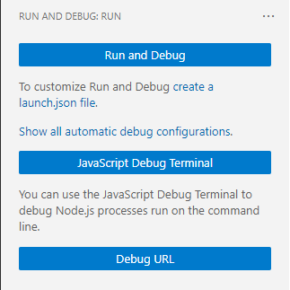

您可以自己手動創建 `launch.json` 檔案來組態環境，但您可以透過單擊 `Run and Debug` 按鈕打開 Select debugger 對話框來自動執行此操作，

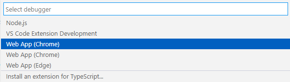
 
選擇 Web App (Chrome)，然後 VS Code 將創建一個 `.vscode\launch.json` 檔案
 
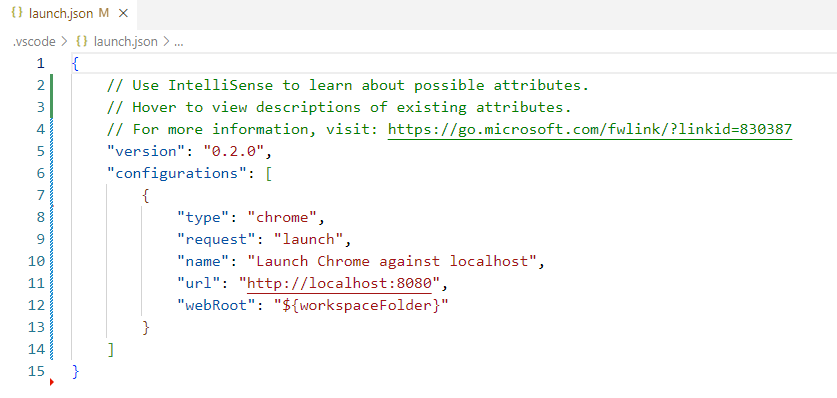
 
您可能需要將 PORT 更改為您的應用程式執行的 PORT，例如 4200。 

## 第 4 步 - 開始偵錯

現在，在 VS Code 中，如果您單擊左側的 Run and Debug 按鈕（或 Ctrl+Shift+D），您將擁有這樣的偵錯環境，

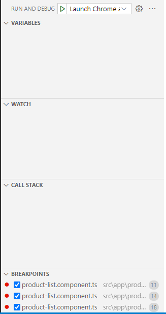
 
透過命令從 Angular CLI 執行應用程式（非常重要，否則偵錯將沒有作用）

```
ng serve -o
```

您將看到應用程式正在執行，

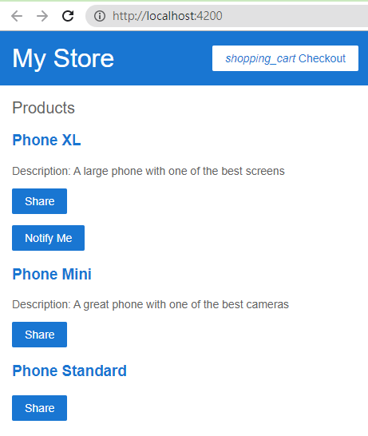

現在，設定中斷點並按下 Start debugging(F5) 按鈕進行偵錯，

[](2022-09-27-11-27-03.png)

一旦偵錯工作階段開始，偵錯工具欄將出現在編輯器的頂部。

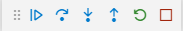

偵錯操作

* Continue F5
* Step Over F10
* Step Into F11
* Step Out Shift+F11
* Restart Ctrl+Shift+F5
* Stop Shift+F5

偵錯畫面如下，

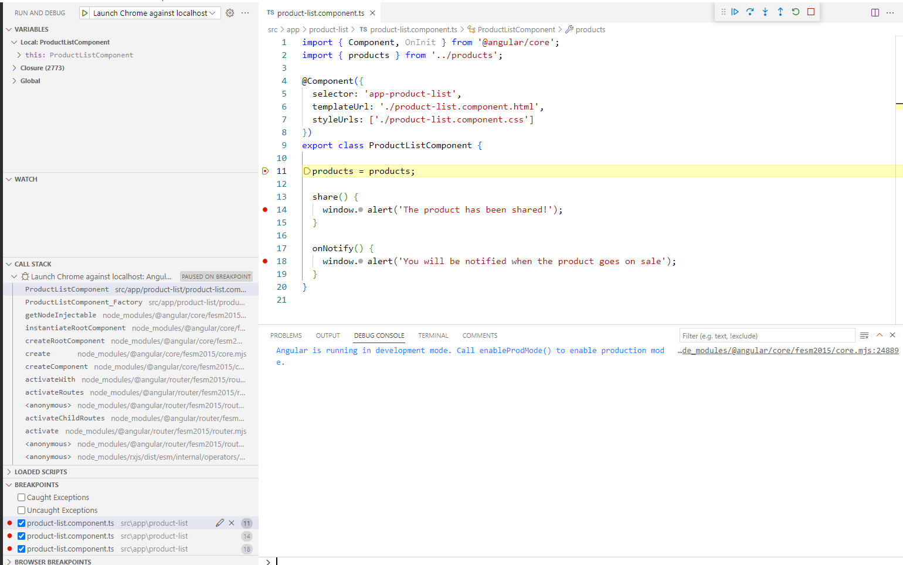

## 參考

* [Debug Angular In VS Code](https://www.c-sharpcorner.com/article/debug-angular-in-vs-code/)
* [Debugging - Visual Studio Code 文件](https://code.visualstudio.com/docs/editor/debugging)
* [Extension MarketPlace - Visual Studio Code 文件](https://code.visualstudio.com/docs/editor/extension-gallery)
* [Visual Studio Code Marketplace](https://marketplace.visualstudio.com/VSCode)
* [Node.js debugging in VS Code - Visual Studio Code 文件](https://code.visualstudio.com/docs/nodejs/nodejs-debugging)
* [Using Angular in Visual Studio Code - Visual Studio Code 文件](https://code.visualstudio.com/docs/nodejs/angular-tutorial)
