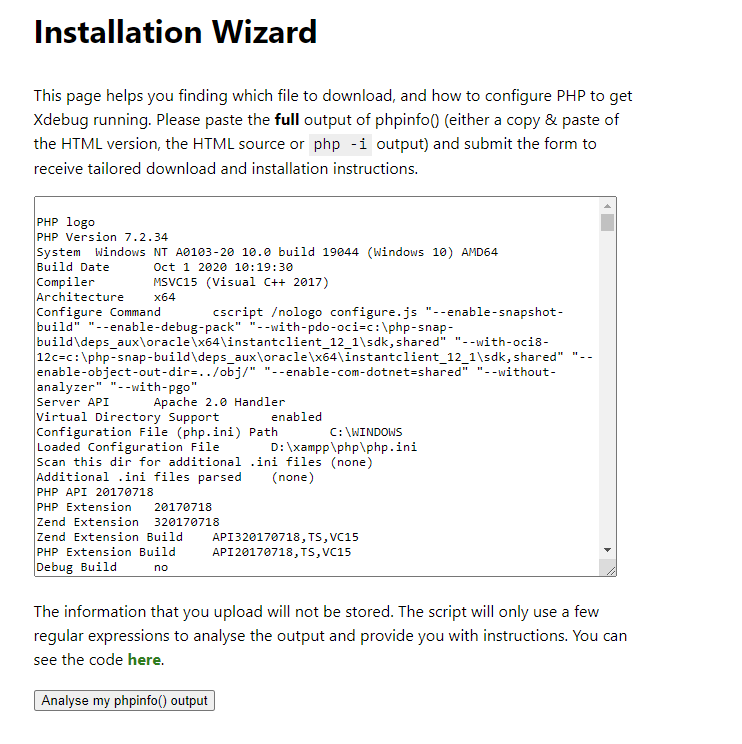
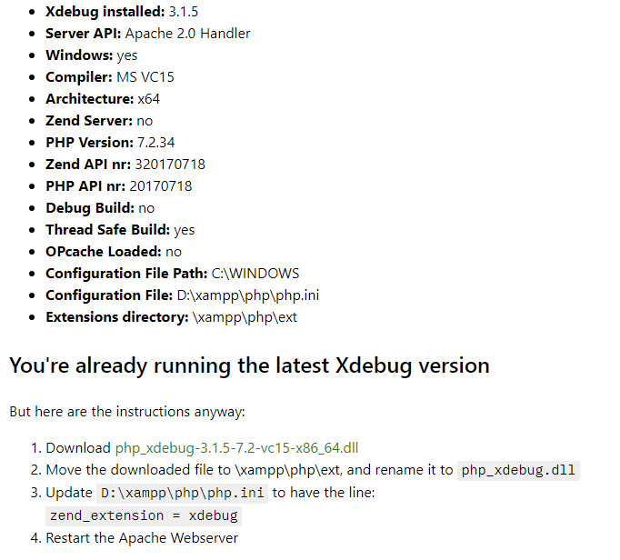
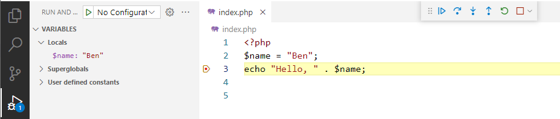
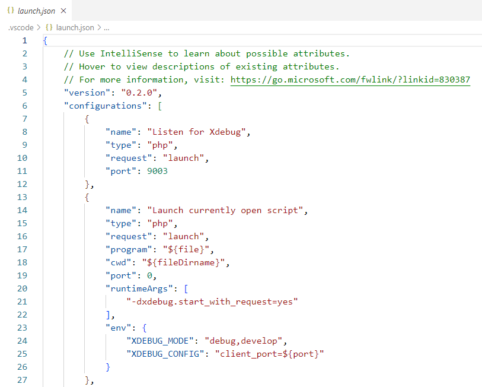
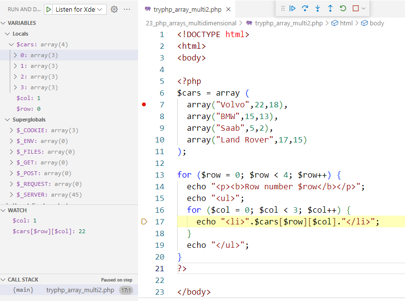

# 使用 Visual Studio Code 偵錯 PHP 程式

以下的 php 執行環境，以 xampp 為例。

## 偵錯環境安裝及設定

1. 安裝 Visual Studio Code 套件：[PHP Debug](https://marketplace.visualstudio.com/items?itemName=xdebug.php-debug)

2. 安裝 [Xdebug](https://xdebug.org/docs/install)

    製作一個簡單的 `phpinfo.php` 檔案，在裡面放一行 `phpinfo();` 敘述

    ```php
    <?php
    phpinfo();
    ```

    開啟瀏覽器，瀏覽到此 `phpinfo.php` 的網址(例如： `http://localhost/test/phpinfo.php`) 以取得 `phpinfo()` 的輸出結果。

    然後複製整個網頁上的文字，並將其貼到 [Xdebug installation wizard](https://xdebug.org/wizard) 中。如下圖：

    

    點選 'Analyse my phpinfo() output' 按鈕進行分析，分析結果如下範例：

    

    依照上圖的指示說明，後續的步驟如下：

    1. 下載 `php_xdebug-3.1.5-7.2-vc15-x86_64.dll`
    2. 將下載的檔案複製到 `D:\xampp\php\ext` 資料夾中，並重命名為 `php_xdebug.dll`。
    3. 更新 `D:\xampp\php\php.ini` 加入此行：

        ```
        zend_extension = xdebug
        ```

    4. 重新啟動 Apache 網路伺服器

3. 修改 Visual Studio Code 設定

    加入 `php.debug.executablePath`，範例如下：

    ```
    "php.debug.executablePath": "D:\\xampp\\php\\php.exe",
    ```

## 簡單程式偵錯(不需要額外的設定檔)

1. 在 php 程式碼中設定中斷點
2. 點選 `Run > Start Debugging (F5)` 後，即可執行 php 程式並停在中斷點上：

    


## WEB Server 偵錯

1. 更新 `php.ini` 加入以下的設定： (適用於 Xdebug v3.xx：)

    ```
    xdebug.mode = debug
    xdebug.start_with_request = yes
    ```

2. 重新啟動 Apache 網路伺服器
3. 以 Visual Studio Code 開啟您的 php web 程式的原始碼
4. 點選 `Run > Add Configuration...` 加入預設的組態檔 (`.Visual Studio Code\launch.json`)

    

5. 設定中斷點
6. 點選 Run > Start Debugging (F5) 開始監聽偵錯，預設會選取 `Listen for Xdebug` 組態。
7. 以瀏覽器瀏覽您要偵錯程式的網址
8. 然後在 Visual Studio Code 中會看到程式執行到中斷點上，如下圖：

    
