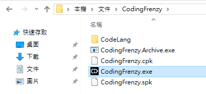
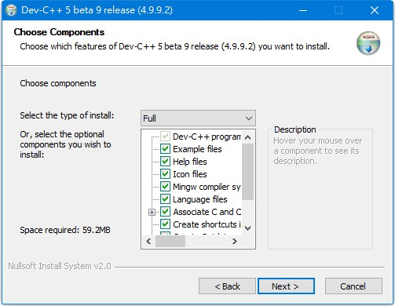
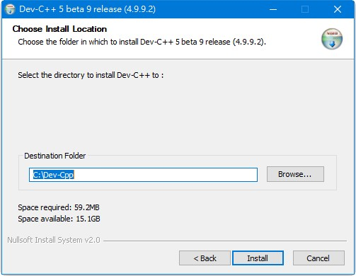
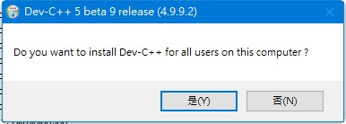

# 瘋狂程設使用手冊

目錄

- [註冊瘋狂帳號](#註冊瘋狂帳號)
- [軟體安裝](#軟體安裝)
	- [安裝 C/C++ 編譯器](#安裝-cc-編譯器)
		- [MinGW](#mingw)
		- [DevC++](#devc)
		- [Microsoft Visual C++ 2008 Express](#microsoft-visual-c-2008-express)
		- [Microsoft Visual C++ 2005 Express](#microsoft-visual-c-2005-express)
	- [安裝 Java JDK](#安裝-java-jdk)
	- [安裝 Python](#安裝-python)
- [登入瘋狂程設](#登入瘋狂程設)
- [解題步驟](#解題步驟)

自動閱卷的程式設計上機考試題庫暨考試系統

為 2013/10/1 起的 [大學程式能力檢定(CPE)](https://cpe.cse.nsysu.edu.tw/index.php) 考試所採用評判系統

網站：http://coding-frenzy.arping.me/

該系統提供完整的上機題庫，支援自動批改、內文規範、作弊防範、作弊偵察、作弊威脅等功能。

## 註冊瘋狂帳號

1. 進入[網站首頁](http://coding-frenzy.arping.me/)，然後點選「1.註冊瘋狂帳號」。

    

2. 輸入您的電子信箱(email 地址)，然後點選「取得帳號金鑰」。

    

3. 系統會寄一封 email 到您的電子信箱，請收取 email，然後點選信件中的連結：

    

4. 填寫資料，並設定您的密碼，然後點選「我同意修改資料，並放棄個資法的求償權利。」

    

## 軟體安裝

1. 下載瘋狂程設軟體

    * 進入[網站首頁](http://coding-frenzy.arping.me/)，點選上方的「下載」
    * 找到 [最新版瘋狂程設軟體](http://coding-frenzy.arping.me/sites/coding-frenzy.arping.me/CodingFrenzy@coding-frenzy.arping.me.zip) 連結，點選該連結
    
        
    
    * 然後會下載瘋狂程設軟體的壓縮檔案(`CodingFrenzy@coding-frenzy.arping.me.zip`)，請解壓縮到 `CodingFrenzy` 目錄下

        

2. 安裝 Microsoft .NET Framework 3.5

    * 因為瘋狂程設軟體是以 Microsoft .NET Framework 所撰寫的，所以必須安裝 Microsoft .NET Framework。
    * 請下載 [Microsoft .NET Framework 3.5 安裝程式(dotNetFx35setup.exe)](https://www.microsoft.com/zh-tw/download/details.aspx?id=21)
    * 執行安裝程式(`dotNetFx35setup.exe`)，然後點選「下載並安裝此功能」(需要啟用 Windows Update)

        

    * 當顯示以下畫面時，表示 Microsoft .NET Framework 3.5 已安裝完成：

        

    * 請點選「關閉」按鈕關閉視窗

    * 當你安裝完 Microsoft .NET Framework 3.5，「瘋狂程設」中就可以使用以下語言的編譯器：

        * Microsoft (R) Visual C# Compiler 
            * MSCS:v2.0.50727
            * MSCS:v3.5
            * MSCS:v4.0.30319
        * Microsoft (R) Visual Basic Compiler 
            * MSVB:v2.0.50727
            * MSVB:v3.5
            * MSVB:v4.0.30319
        * Microsoft (R) JScript Compiler 
            * MSJS:v2.0.50727
            * MSJS:v4.0.30319

3. 安裝其他語言(C/C++, Java, Python)的編譯器：請參考以下各節的說明。

### 安裝 C/C++ 編譯器

C/C++語言使用者才需要安裝

「瘋狂程設」支援以下編譯器，請從官網下載編譯器，並安裝在預設位置(不可更改安裝路徑)。

* MinGW  (預設位置為 `C:\MinGW`)
* DevC++ (預設位置為 `C:\Dev-Cpp`)
* Microsoft Visual C++ 2008 Express
* Microsoft Visual C++ 2005 Express

#### MinGW

C/C++語言使用者建議安裝 MinGW 環境的 gcc/g++ 編譯器。

* 前往 [MinGW 下載網頁](https://osdn.net/projects/mingw/releases/)
* 下載 MinGW 安裝管理員安裝程式(`mingw-get-setup.exe`)

    

* 執行 MinGW 安裝管理員安裝程式(`mingw-get-setup.exe`)，然後點選「Install」：

    

* 安裝路徑使用預設的 `C:\MinGW`，然後點選「Continue」：

    

* 安裝程式會開始下載必要的檔案，當進度條跑到 100 % 後，請點選「Continue」：

    

* 此時會啟動 MinGW 安裝管理員，請在右方的「mingw32-gcc-g++-bin」按右鍵，然後點選「Mark for installation」以標記要安裝的套件：

    

* 標記完，右方的核取方塊就改變圖示了：

    

* 點選「File」功能表，然後選擇「Apply Changes」，表示套用改變：

    

* 此時請點選「Apply」，確定套用改變，並開始安裝剛剛選擇的「mingw32-gcc-g++-bin」套件：

    

* 開始下載套件並安裝相關的檔案：

    

* 當顯示以下畫面時，表示所有的檔變都已下載並安裝完成，請點選「Close」關閉對話視窗：

    

* 此時會回到 MinGW 安裝管理員主畫面，可以看到核取方塊以綠色填滿，表示「mingw32-gcc-g++-bin」套件已安裝：

    

* 安裝完成後，「瘋狂程設」編譯器選單就會有「CCPP:MinGW」可選擇。

#### DevC++

* 前往 [官方網站](http://www.bloodshed.net/)

* 下載「Dev-C++ 5.0 (4.9.9.2)」包含 Mingw/GCC 3.4.2 編譯器和 GDB 5.2.1 除錯器

* 執行安裝程式(`devcpp-4.9.9.2_setup.exe`)

* 啟動時，會有如下的警告訊息，警告若先前有安裝 Dev-C++ 時，請不要安裝此版本，請按下「確定」按鈕：

	

* 選擇安裝程式的顯示語言，請按下「OK」按鈕：

	

* 按「I Agree」按鈕：

	

* 按「Next」按鈕：

	

* 預設安裝路徑請保留預設值 `C:\Dev-Cpp`，然後按「Install」按鈕開始安裝：

	

* 下圖是安裝中的顯示畫面：

	

* 安裝完成時，會問你是否要安裝給此電腦的所有使用者，點選「是」：

	

* 安裝完成，請按「Finish」按鈕並啟動Dev-C++軟體(如不想啟動，可取消勾選 `Run Dev-C++5 beta 9 release (4.9.9.2)`)：

	

安裝大小約 60 MB(請一定要安裝在預設路徑 `Dev-Cpp`)。

安裝完成後，「瘋狂程設」編譯器選單會有「CCPP:Dev-Cpp」可選擇。

#### Microsoft Visual C++ 2008 Express

此為舊版軟體，微軟已不再支援，所以，不建議安裝此版軟體，若有興趣仍可依下列步驟進行安裝：

* 下載 [Visual C++ 2008 Express Edition](https://go.microsoft.com/?linkid=7729279) 安裝程式(`vcsetup.exe`)

* 執行安裝程式(`vcsetup.exe`)

* 歡迎畫面，點選「Next」按鈕繼續下一步驟：

    

* 同意授權條款，點選「Next」按鈕繼續下一步驟：

    

* 選擇是否要安裝 SQL Server 2008 Express (可不用安裝)，點選「Next」按鈕繼續下一步驟：

    

* 選擇安裝路徑(使用預設值即可)，點選「Install」按鈕開始安裝：

    

* 此為安裝中的畫面：

    

* 當顯示以下畫面時，按示已安裝完成，點選「Exit」按鈕結束安裝程式：

    

安裝大小約 1.1 GB，請安裝在預設路徑 `C:\Program Files (x86)\Microsoft Visual Studio 9.0`。

安裝完成後，「瘋狂程設」編譯器選單會有「MSVC:Microsoft Visual Studio 9.0」可選擇。

註：Visual Studio 2008 於 2018 年 4 月 10 日終止支援。目前仍可下載安裝程式進行安裝，但將來可能會移除

#### Microsoft Visual C++ 2005 Express

此為舊版軟體，微軟已不再支援，所以，不建議安裝此版軟體，若有興趣仍可依下列步驟進行安裝：

 * 下載 [Visual C++ 2005 Express Edition](https://go.microsoft.com/fwlink/?LinkId=51410&clcid=0x409) 安裝程式(`vcsetup.exe`)

* 啟動安裝程式(`vcsetup.exe`)

* 歡迎畫面，按「Next」按鈕繼續下一步驟：

    

* 同意使用者授權條款，按「Next」按鈕繼續下一步驟：

    

* 安裝選項，選「Graphical IDE」，按「Next」按鈕繼續下一步驟：

    

* 安裝路徑(使用預設值)，按「Install」按鈕開始安裝：

    

* 此為安裝中的畫面：

    

* 當顯示以下的畫面時，表示已安裝完成，按「Exit」按鈕結束安裝程式：

    


安裝大小約為 542 MB，若不裝 IDE，約只需 375 MB。請安裝在預設路徑 `C:\Program Files (x86)\Microsoft Visual Studio 8`。

安裝完成後，「瘋狂程設」的編譯器選單會有「MSVC:Microsoft Visual Studio 8」可選擇。

### 安裝 Java JDK

* 前往 [Java SE Development Kit 8 Downloads](https://www.oracle.com/java/technologies/javase/javase-jdk8-downloads.html) 頁面

* 下載 `jdk-8u271-windows-x64.exe`

* 執行安裝程式(`jdk-8u271-windows-x64.exe`)

請安裝在預設路徑： `C:\Program Files\Java\jdk1.8.0_271\`

安裝完成後，「瘋狂程設」的編譯器選單會有「JAVA:jdk1.8.0_271」可選擇。

### 安裝 Python

* 前往 [Python 官網](https://www.python.org/) 下載 Python 安裝程式(`python-3.9.1-amd64.exe`)，目前最新版為 Python 3.9.1。

* 執行安裝程式(`python-3.9.1-amd64.exe`)

請安裝在預設路徑 `%USERPROFILE%\AppData\Local\Programs\Python\Python39`

安裝完成後，「瘋狂程設」的編譯器選單會有「PYTH:Python39」可選擇。

## 登入瘋狂程設

1. 執行瘋狂程設軟體，請雙擊「`CodingFrenzy.exe`」：

    

2. 點選「同意以下各授權規定」：

    

3. 進入主畫面後，輸入註冊時填寫的學號或：

    * 准考證號碼、學號或信箱: 輸入註冊時學號或電子信箱
    * 密碼：輸入註冊時設定的密碼
    * 點選「會員登入」按鈕進行登入

    

4. 進入「程式廣場」畫面，左方課程列表中有各種課程，請點選「程式練習廣場」。

    

5. 左邊是選定課程中的關卡列表，請點選其中一個關卡，再點選「練習」：

    

6. 此為題目練習視窗，視窗各區塊的功能說明如下：

    1. 功能表
    2. 解題步驟說明，可按右上角的 x 按鈕關閉此區塊
    3. 程式碼輸入
    4. 程式輸出
    5. 建置測試：包含以下各項目。
        * 題目資料：會顯示題目說明，輸入的程式碼必須符合題目要求，編譯測試才會通過。
        * 語法規範
        * 編譯測試結果
        * 語意檢測

    

7. 請從編譯器選單選擇要使用的編譯器：

    

8. 依照題目資料撰寫程式後，按下「隨機測資」功能，即可進行編譯測試：

    

9. 編譯測試時，功能表會暫時無法使用：

    

10. 編譯測試完成後，右方的「建置測試」區塊會顯示測試結果，若顯示「CORRECT」表示通過：

    

11. 若「建置測試」區塊示「COMPILER-ERROR」表示編譯錯誤，可點選「語法規範」確認問題：

    

12. 若「建置測試」區塊示「WRONG-ANSWER 」表示錯誤的答案，表示不符合題目要求，可點選「語意檢測」確認問題(以黃底字標示的字元，表示錯誤輸出的部分)：

    

13. 請點選「批改交卷」

    

14. 「批改交卷」完成會顯示訊息：

    

15. 此時會顯示「通過」，表示此題目練習已通過 (符合題目要求)：

    

16. 此時可關閉題目練習視窗


## 解題步驟

以 C 程式輸出 `Hello World!`為例：

1. 撰寫`main`函數

    ```cpp
    int main(){
        return 0;
    }
    ```

2. 為了使用`printf`，要含入標頭檔`<stdio.h>`：

    ```cpp
    #include <stdio.h>

    int main(){
        return 0;
    }
    ```

3. 使用`printf`輸出 `Hello World!`：

    ```cpp
    #include <stdio.h>

    int main(){
        printf("Hello World!\n");
        return 0;
    }
    ```

以 C++ 程式輸出 `Hello World!`為例：

1. 撰寫`main`函數

    ```cpp
    int main(){
        return 0;
    }
    ```

2. 為了使用`cout`，要含入標頭檔`<iostream>`：

    ```cpp
    #include <iostream>
    int main(){
        return 0;
    }
    ```

3. 使用`std::cout`輸出 `Hello World!`：

    ```cpp
    #include<iostream>
    int main(){
        std::cout<<"Hello World!";
        return 0;
    }
    ```
