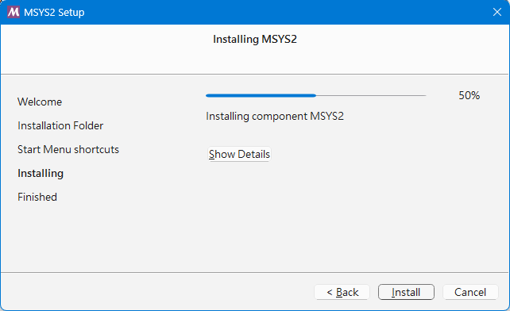

# 在 VSCode 中開發 C++ 程式的入門指南

本文以 windows 平台進行說明，進一步資訊，請參考 [Visual Studio Code 的 C/C++](https://vscode.dev.org.tw/docs/languages/cpp)

## 步驟 1：安裝 Visual Studio Code

1. 前往[Visual Studio Code 官方網站](https://vscode.dev.org.tw/)。
2. 下載適合你作業系統的安裝程式（Windows、macOS 或 Linux）。
3. 安裝 VSCode，並啟動應用程式。

## 步驟 2：安裝 C++ 編譯器

1. 下載並安裝[MinGW](https://github.com/msys2/msys2-installer/releases/download/2024-12-08/msys2-x86_64-20241208.exe)。

2. 啟動安裝程式 (`msys2-x86_64-20241208.exe`)

    

    按「Next」按鈕

3. 選擇安裝路徑

    
    
    按「Next」按鈕

4. 輸入開始功能表中的資料夾名稱(用來存放MSYS2相關程式的捷徑)

    
    
    按「Next」按鈕

5. 安裝進行中

    

6. 安裝完成
  請確保已勾選 [Run MSYS2 now.] 方塊，然後按「Finish」按鈕。這將為您開啟 MSYS2 終端機視窗。

    

7. 在此終端機中，執行下列命令來安裝 MinGW-w64 工具鏈

    ```
    pacman -S --needed base-devel mingw-w64-ucrt-x86_64-toolchain
    ```

    

    按下 Enter 以接受 toolchain 群組中的預設套件數量。

    

    當系統提示是否繼續安裝時，輸入`Y`進行安裝。

    

    當系統提示顯示命令提示字元`$`表示已安裝完成。

    請輸入 `exit`，按 `Enter` 鍵關閉視窗。

## 步驟 3：安裝 C++ 擴充套件

1. 打開 VSCode，點擊左側的擴展圖示（或按`Ctrl+Shift+X`）。

2. 在搜尋框中輸入`C/C++`，找到 Microsoft 提供的 [C/C++ Extension Pack](https://marketplace.visualstudio.com/items?itemName=ms-vscode.cpptools-extension-pack) 擴充套件並安裝。

## 步驟 4：創建 C++ 專案

1. 在 VSCode 中，選擇`檔案`>`新建檔案`，然後將其保存為`main.cpp`。

2. 在`main.cpp`中輸入以下範例程式碼：

    ```cpp
    #include <iostream>
    using namespace std;

    int main() {
        cout << "Hello, World!" << endl;
        return 0;
    }
    ```

## 步驟 5：配置編譯和執行

1. 按下編輯器右上角的播放按鈕。

   

2. 從系統上偵測到的編譯器清單中，選擇 C/C++: g++.exe 建置並偵錯作用中的檔案。

   

3. 你應該會看到輸出`Hello, World!`。

   

## 結束

恭喜你！你已經成功設置了 VSCode 以開發 C++ 程式。你可以開始編寫更複雜的程式，並利用 VSCode 的強大功能來提高你的開發效率。
