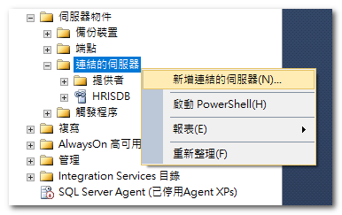
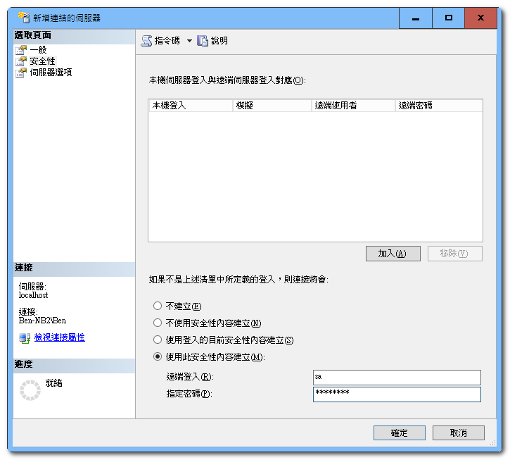

# 建立連結伺服器(DB LINK)

步驟：

* 使用圖形介面

    1. 開啟「SQL SERVER Management Studio」
    2. 展開「伺服器物件」後在「連結的伺服器」上「右鍵」，點選「新增連結的伺服器」
    
        
    
    3. 在「新增連結的伺服器」視窗中的「一般」頁籤依序輸入如下欄位：
        * 連結的伺服器：輸入連結的伺服器名稱(例如：`AR`)
        * 伺服器類型：點選「其他資料來源」
        * 提供者：下拉選單選「Microsoft OLE DB Provider for SQL Server」
        * 產品名稱：輸入「`SQLNCLI`」
        * 資料來源：輸入資料庫主機（例如：「10.48.16.10」）
        
            

    4. 在「新增連結的伺服器」視窗中點選「安全性」頁籤，然後依序輸入如下欄位，輸入完後按下「確定」
        * 點選「使用此安全性內容建立」
        * 遠端登入：「User Name」-> 此 User 在資料庫主機上需要有權限
        * 指定密碼：「Password」-> User 密碼

            

    以上程序完成後便可使用此 DB Link，例如：`SELECT * FROM [AR]..[資料庫名稱].[dbo].[TABLE NAME]`

* 使用 T-SQL

    ```sql
    USE [master]
    GO
    EXEC master.dbo.sp_addlinkedserver 
        @server = N'AR',          -- 連結的伺服器
        @srvproduct=N'SQLNCLI',   -- 產品名稱(SQLNCLI)
        @provider=N'SQLOLEDB',    -- 提供者
        @datasrc=N'10.48.16.10'   -- 資料來源(預設執行個體)
    GO

    EXEC master.dbo.sp_addlinkedsrvlogin 
    @rmtsrvname = N'AR',         -- 連結的伺服器
    @useself = N'False', 
    @rmtuser = N'User Name',     -- 遠端登入
    @rmtpassword = N'Password'　 -- 指定密碼
    GO
    ```

參考資料及說明：

* [sp_addlinkedserver(建立連結伺服器)](https://technet.microsoft.com/zh-tw/library/ms190479(v=sql.105).aspx)
* [sp_addlinkedsrvlogin(建立連結伺服器登入)](https://technet.microsoft.com/zh-tw/library/ms189811(v=sql.105).aspx)
* [連結伺服器的安全性](https://technet.microsoft.com/zh-tw/library/ms175537(v=sql.105).aspx)


