# 安裝 TortoiseGit

請前往 [TortoiseGit 官網](https://tortoisegit.org/)，點選 Download：

點選 for 64-bit Windows 下方的連結，下載 64 位元安裝程式

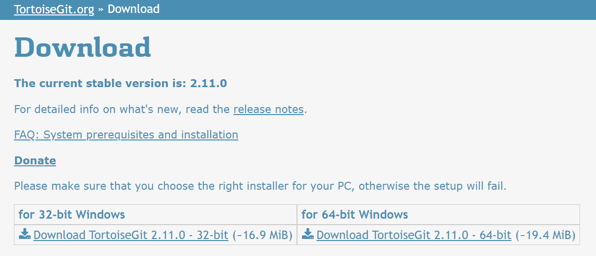

> 本文件撰寫時，下載的安裝程式檔案為 `TortoiseGit-2.11.0.0-64bit.msi`

執行安裝程式

此為歡迎畫面，請點選 `Next` 繼續：

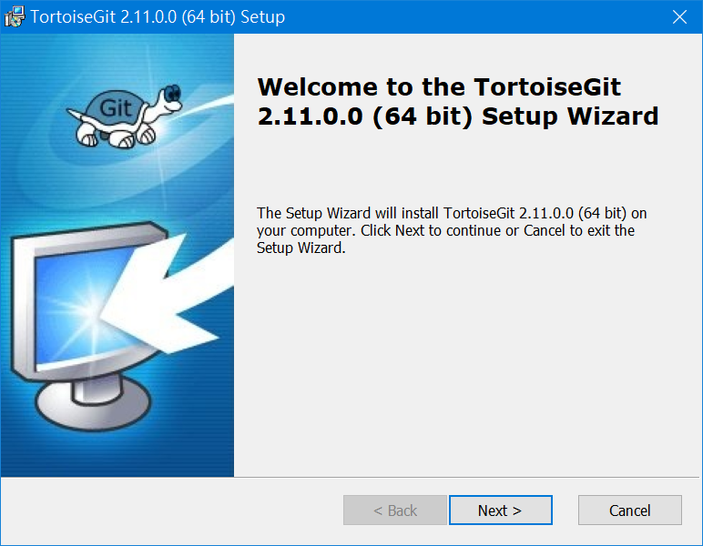

請先閱讀有關軟體的重要資訊，然後點選 `Next` 繼續：

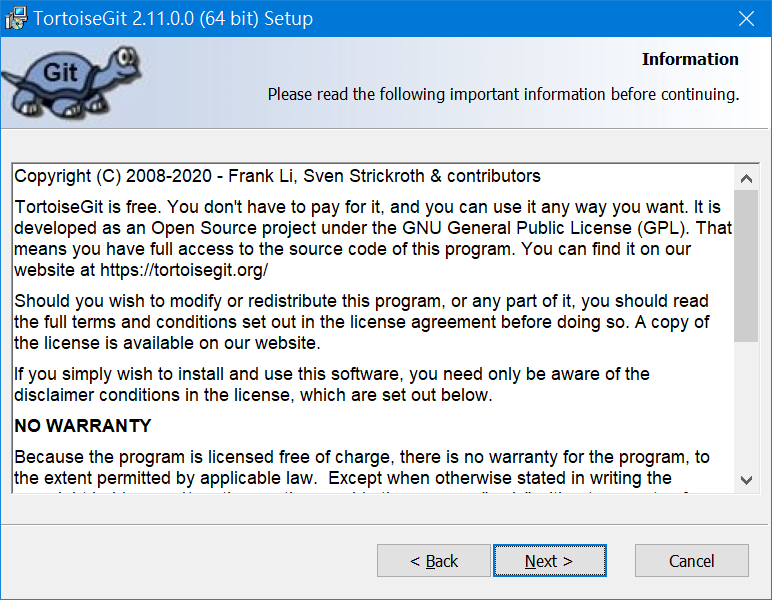

選擇要使用哪一種 SSH 用戶端，請點選 `Next` 繼續：

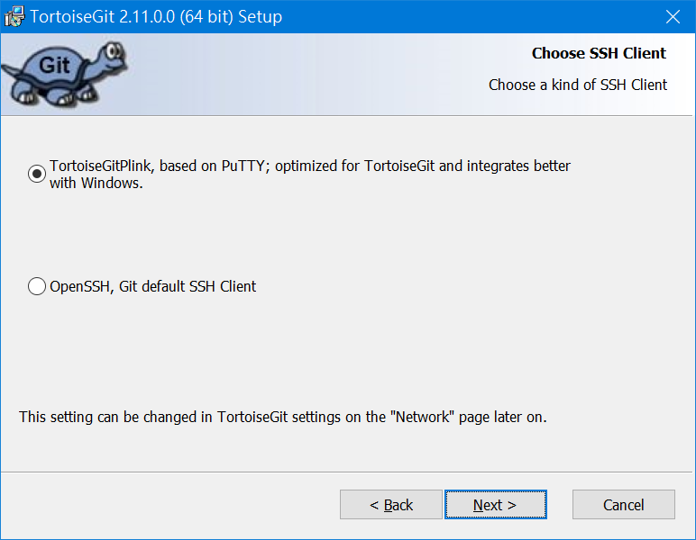

選擇安裝位置以及要安裝的功能，請點選 `Next` 繼續：

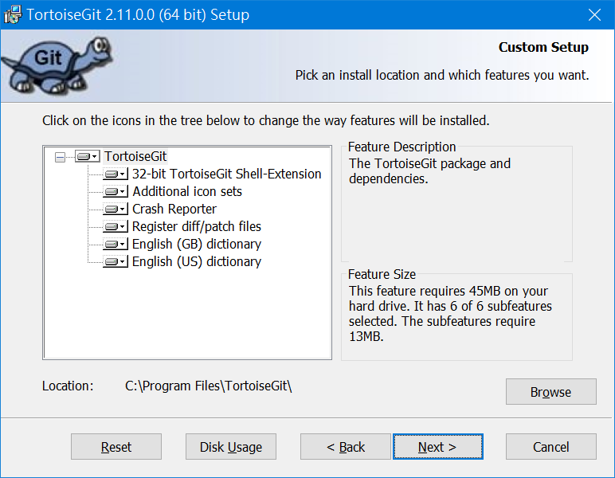

請點選 `Install` 開始安裝：

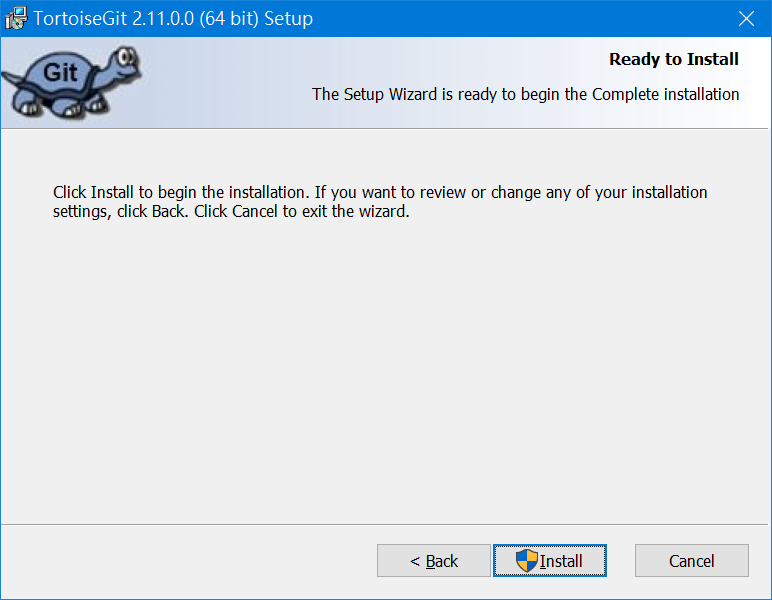

此為安裝中的畫面：

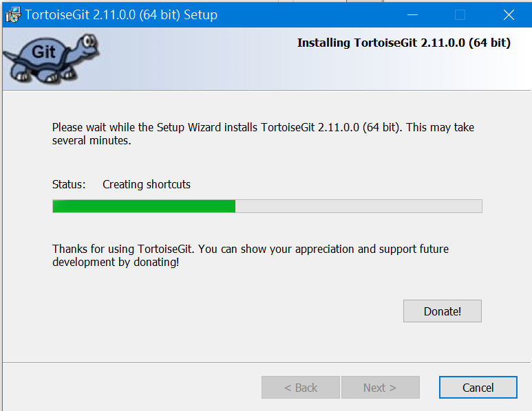

完成安裝，請點選 `Finish` 結束安裝程式，並執行首次啟動精靈：

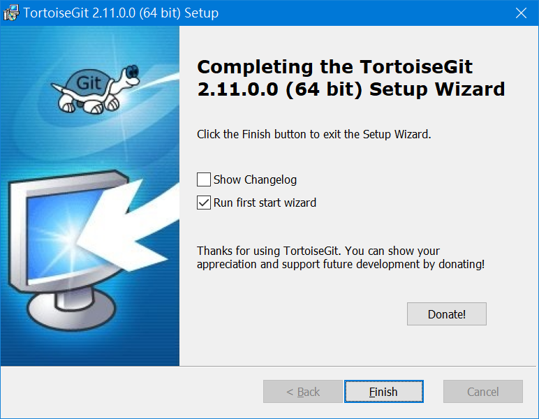

請點選「下一步」繼續：

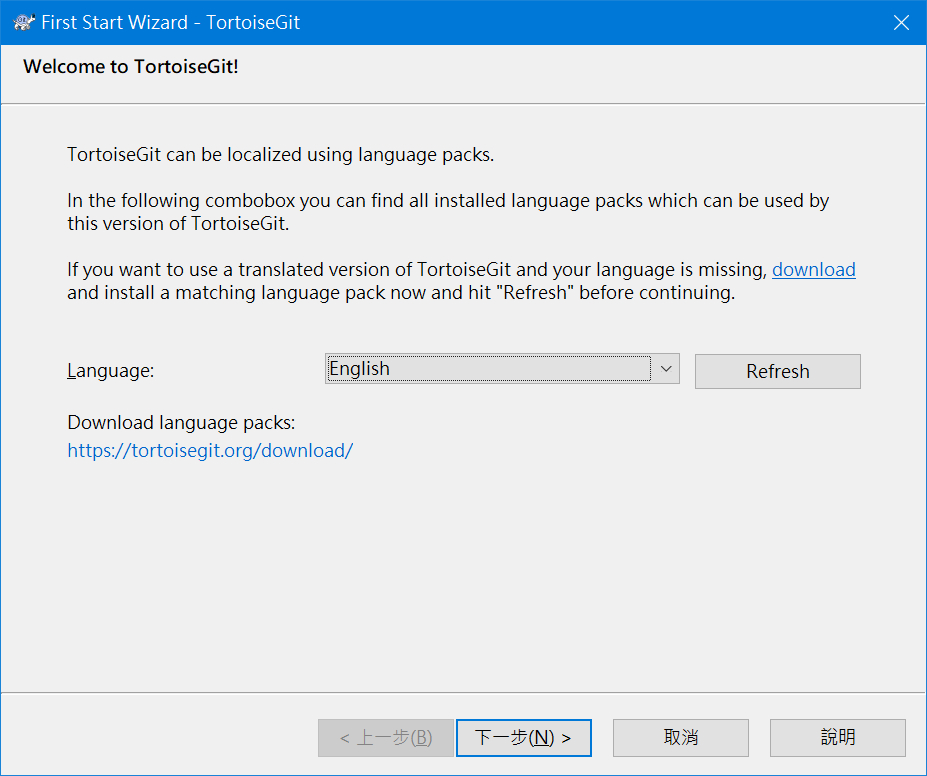

再點選「下一步」繼續：

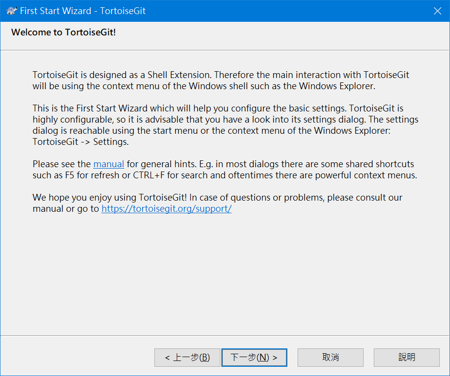

設定 `git.exe` 的檔案路徑，因為 TortoiseGit 需要 git.exe 才能正常操作，本精靈會自動偵測路徑，請點選「下一步」繼續：

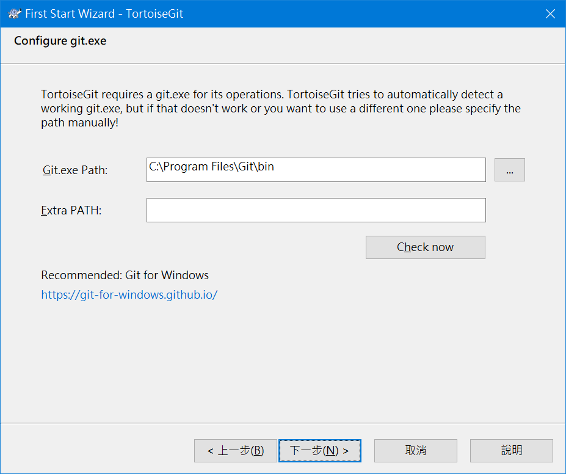

輸入姓名和 Email，Git 需要你設定使用者名稱和 Email，用於包含在每次提交(commit)的人員資訊，請點選「下一步」繼續：

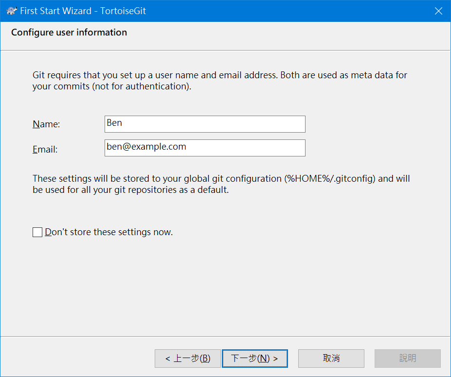

此處可設定驗證及帳號儲存的方式，請點選「完成」關閉「First Start Wizard」視窗：

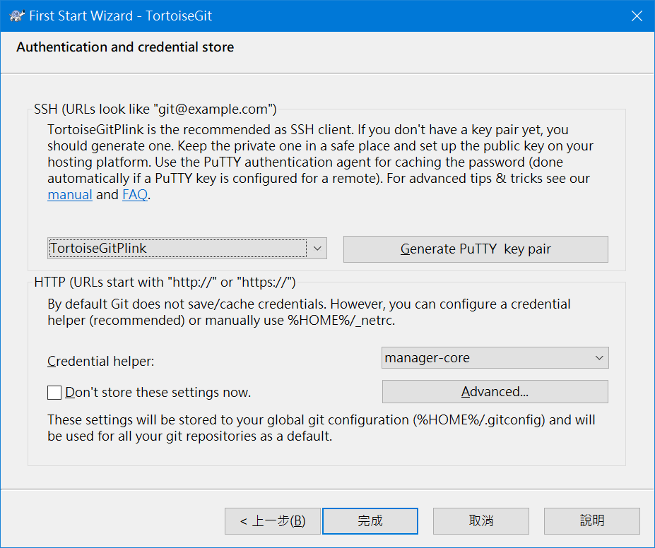
