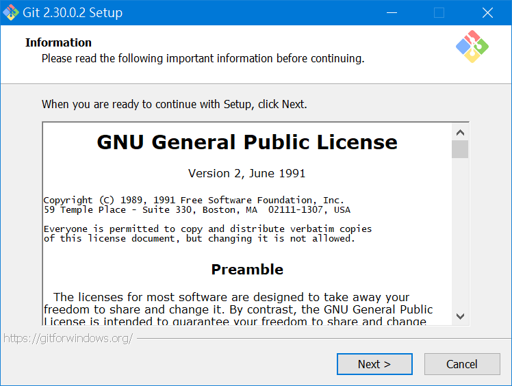

# 安裝 Git For Windows

請到 [Git 官網](https://git-scm.com/) 


請點選右下角的下載圖示，網頁會自動下載 Git 安裝程式。


> 此文件撰寫時的安裝檔案為 `Git-2.30.0.2-64-bit.exe`
>
> 如果沒有自動下載，請自行點選適當版本的安裝程式，建議點選「64-bit Git for Windows Setup」

執行安裝程式

繼續安裝前，請閱讀關於此軟體的重要資訊，然後點選 `Next` 繼續：



選擇安裝路徑，使用預設值即可，然後點選 `Next` 繼續：


選擇安裝元件，請點選 `Next` 繼續：


選擇開始功能表的資料夾名稱，請點選 `Next` 繼續：


選擇預設編輯器，請點選 `Next` 繼續：


調整初始分支名稱，請點選 `Next` 繼續：


調整 `PATH` 環境變數，請點選 `Next` 繼續：


選擇 HTTPS 連線的程式庫，請點選 `Next` 繼續：


設定換行符號的轉換方式，請點選 `Next` 繼續：


設定 Git Bash 要使用的終端模擬器，請點選 `Next` 繼續：


選擇 `git pull` 的預設行為，請點選 `Next` 繼續：


選擇登入帳號管理員，請點選 `Next` 繼續：


設定額外的選項，請點選 `Next` 繼續：


設定實驗選項，請點選 `Install` 開始安裝：


這是安裝中的畫面：


安裝完成，請點選 `Finish` 關閉安裝程式：


## 確認 Git 是否安裝成功

從開始功能表中點選 `Git Bash`：


在 Git Bash 中輸入以下命令：

```
git --version
```

如果可以顯示 git 的版本號碼，則表示安裝成功，如下圖：


請輸入以下命令關閉 Git Bash：

```
exit
```
