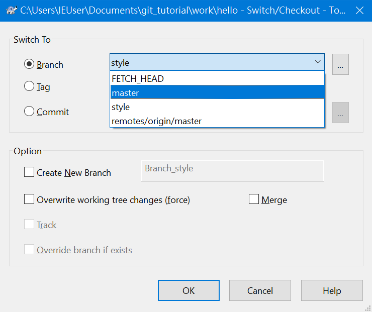

# Git 教學

本教學的目的在說明基礎的 git 操作，使用的是 TortoiseGit。

- [Git 教學](#git-教學)
	- [軟體安裝](#軟體安裝)
	- [設定](#設定)
	- [儲存庫](#儲存庫)
		- [在現有目錄初始化儲存庫](#在現有目錄初始化儲存庫)
		- [從遠端伺服器複製儲存庫](#從遠端伺服器複製儲存庫)
	- [提交更新](#提交更新)
	- [檢視提交的歷史記錄](#檢視提交的歷史記錄)
	- [檢視修改狀態](#檢視修改狀態)
	- [檢視檔案內容修改的差異](#檢視檔案內容修改的差異)
	- [復原已被更動的檔案](#復原已被更動的檔案)
	- [忽略某些檔案](#忽略某些檔案)
	- [復原至前一次的提交](#復原至前一次的提交)
	- [遠端操作](#遠端操作)
		- [新增遠端儲存庫](#新增遠端儲存庫)
		- [上傳到遠端儲存庫](#上傳到遠端儲存庫)
		- [從遠端擷取及合併(Pull)](#從遠端擷取及合併pull)
	- [分支](#分支)
		- [建立新分支](#建立新分支)
		- [切換分支](#切換分支)
		- [合併分支](#合併分支)
		- [刪除分支](#刪除分支)
	- [解決衝突](#解決衝突)
	- [其他操作](#其他操作)
		- [查看引用日誌](#查看引用日誌)
		- [移動檔案](#移動檔案)
		- [修改上一次的提交](#修改上一次的提交)
		- [建立裸儲存庫](#建立裸儲存庫)

## 軟體安裝

* Git for Windows
* TortoiseGit: 是一個 Git 圖形使用介面(GUI)軟體，可充分的與檔案總管整合。雖然 Git 本身也有提供 GUI 及命令列工具，但是仍讓人覺得不容易使用，所以才會有其他的第三方 GUI 軟體的出現。

## 設定

## 儲存庫

儲存庫是用來保存你每次的提交

* 本機儲存庫：是一個特別的 `.git` 目錄
* 遠端儲存庫：遠端伺服器上的儲存庫，也可以是在其他目錄上的裸儲存庫(沒有工作檔案的目錄)。

### 在現有目錄初始化儲存庫

1. 在工作資料夾的背景按右鍵，選擇「Git Create repository here...」

	

2. 點選 OK 按鈕

	

3. TortoiseGit 會告訴你已建立 repository

	

### 從遠端伺服器複製儲存庫

1. 在工作目錄的父目錄背景按右鍵，選擇「Git Clone...」：

	

2. 此時會顯示 Git clone 視窗，`URL` 請輸入遠端儲存庫網址，`Directory` 會依據網址最後一個部分(不含 .git)自動填入。例如，遠端儲存庫網址是以 `git_tutorial.git` 結尾，則會在目前目錄下建立 `git_tutorial` 子目錄。請點選「OK」按鈕執行 Git clone 操作：

	

3. 當操作完成後，會顯示如下的晝面，請點選「Close」按鈕關閉視窗：

	

4. 此時會在父目錄上建立 Git 工作目錄(例如，`git_tutorial`)，此目錄會包含 `.git` 子目錄，及最新版本的檔案：

	

	

## 提交更新

1. 在工作資料夾的背景按右鍵，選擇「Git Commit -> "master"...」(雙引號裡的名稱表示目前的分支名稱，本範例的分支名稱為 `master`)

	

2. 在 Message 下方的文字輸入框，請輸入提交訊息。下方的檔案清單中，請勾選要加入版本控制的檔案(Status 欄位標示為 `Unknown`)。最後點選「Commit」按鈕進行提交。

	

3. 此時會顯示進度視窗，提交成功會顯示訊息(Success)，點選「Close」按鈕關閉視窗即可。

	

## 檢視提交的歷史記錄

1. 在工作資料夾的背景按右鍵，從「TortoiseGit」子選單中選擇「Show log」

	

2. 下圖為提交歷史記錄的視窗

	

	紅底字的 `master` 表示目前的分支名稱

## 檢視修改狀態

1. 在工作資料夾的背景按右鍵，從「TortoiseGit」子選單中選擇「Check for modifications」

	

2. TortoiseGit 會顯示目前有修改的檔案清單，如下圖：

	

## 檢視檔案內容修改的差異

1. 在檔案上按右鍵，選擇「Compare with base」

	

2. 這個顯示此檔案與前一版(在儲存庫中的最新版)的內容差異：

	

3. 左邊會顯示前一版的檔案內容，標題列顯示檔名及檔名的 HASH。右邊則會顯示目前版本(工作目錄中)的檔案內容，標題列顯示檔名及 Working Tree。

## 復原已被更動的檔案

1. 若要復原單一檔案，請在檔案上按右鍵。若要復原目錄下(含子目錄)的所有的檔案變更，請在資料夾的背景按右鍵。然後從「TortoiseGit」子選單中選擇「Revert...」，如下圖：

	

2. TortoiseGit 會顯示目前有修改的檔案清單，如下圖：

	

3. 點選「OK」按鈕，TortoiseGit 會顯示如下圖的畫面，表示已復原已被更動的檔案。

	

4. 點選「OK」按鈕關閉訊息視窗。

## 忽略某些檔案

1. 若要忽略單一檔案，請在檔案上按右鍵。若要忽略單一資料夾，請在資料夾上按右鍵。然後從「TortoiseGit」子選單中選擇「Add to ignore list」子選單的檔名或以副檔名結尾的所有檔案(例如 `*.log`)，如下圖：

	

2. TortoiseGit 會顯示如下的畫面：

	

3. 請點選「OK」按鈕執行此操作，這會在工作目錄的根目錄中產生一個 `.gitignore` 檔案。

## 復原至前一次的提交

1. 在工作資料夾的背景按右鍵，從「TortoiseGit」子選單中選擇「Show log」
2. 在前一次的提交上按右鍵，點選「Revert change by this commit」：

	

3. 此時會顯示確認訊息：

	

4. 當前一次的提交的檔案皆已復原後，會顯示確認訊息：

	

5. 此時您可以直接進行提交(點選 Commit)。或點選「OK」後，可對檔案作些修改，然後再進行提交。(若選擇點選「OK」，請記得稍後要進行提交，否則檔案的狀態會停留在 REVERTING，若要復原此操作，必須使用 Reset 功能才能復原。)

	若點選 Commit，則會自動填入提交訊息，如下圖：

	

	請點選「Commit」按鈕進行提交即可

## 遠端操作

### 新增遠端儲存庫

1. 在工作資料夾的背景按右鍵，從「TortoiseGit」子選單中選擇「Settings」

	

2. 此時會顯示訊息，告知 Git 使用的是階層式組態，你可以勾選左下方的核取方塊，這樣下次就不會再顯示此訊息：

	

3. TortoiseGit 會顯示 Settings 對話視窗，請點選左邊的 Remote (Git/Remote)，請在 URL 欄位輸入遠端儲存庫的網址，輸入完成後，Remote 欄位會自動填入預設名稱 `origin`，請點選下方的「確定」按鈕完成遠端儲存庫的設定：

	

	此時會顯示如下的訊息，詢問你是否要抓取(Fetch)遠端分支的提交記錄，請點選「是」：

	

	然後會顯示 Fetch 對話視窗，請點選「OK」按鈕即可，如下圖：

	

	然後會顯示 Fetch 進度視窗：

	

	若為第一次連接遠端儲存庫，可能需要登入：

	

	上圖為 Github 的登入視窗，請點選 Sign in with your browser，當登入完成，TortoiseGit 會繼續抓取遠端儲存庫的提交記錄，完成時會顯示如下的畫面：

	

	此時請點選「Close」按鈕關閉視窗

### 上傳到遠端儲存庫

1. 在工作資料夾的背景按右鍵，點選「Git Sync...」：

	

2. 此時會顯示「Git Synchronization」對話視窗，請請點選下方的「Push」按鈕：

	

3. 若目前分支 `master` 沒有設定追蹤遠端儲存庫的分支，此時會詢問你是否要設定目前分支 `master` 去追蹤遠端的 `master` 分支，以便將來在進行 `pull` / `push` 可自動選擇遠端的分支，請選擇「是」按鈕即可：

	

4. 當 push 完成後，會顯示如下畫面，請點選「Close」按鈕關閉視窗即可：

	

### 從遠端擷取及合併(Pull)

1. 在工作資料夾的背景按右鍵，點選「Git Sync...」：

	

2. 此時會顯示「Git Synchronization」對話視窗，請請點選下方的「Pull」按鈕：

	

3. 當 Pull 完成後，會顯示如下畫面，請點選「Close」按鈕關閉視窗即可：

	「In Commits」頁籤會顯示遠端新的提交記錄，橘底字的 `origin/master` 表示遠端的分支：

	

	「Log」頁籤會顯示 git pull 執行的結果：

	

## 分支

### 建立新分支

1. 在工作資料夾的背景按右鍵，從「TortoiseGit」子選單中選擇「Show log」以顯示提交歷史記錄視窗。

2. 在目前分支名稱(例如 `master`)上按右鍵，點選「Create Branch at this version...」

	

3. 在 Branch 文字框中輸入分支名稱(例如 `style`)，並勾選 `Switch to new branch`，表示建立完分支後，立即切換到新的分支，然後點選「OK」按鈕即可建立新分支：

	

4. 建立新分支完成後，會顯示如下圖的畫面，請點選「Close」按鈕關閉視窗：

	

5. 點選左上角的分支名稱：

	

6. 此時會打開 Browse references 視窗，請點選下方的「Current Branch」按鈕：

	

7. 此時左上角的分支名稱會顯示目前的分支名稱(`style`)，在提交記錄列表中也可以看到新建立的分支以紅底字來標示：

	

### 切換分支

1. 在工作資料夾的背景按右鍵，從「TortoiseGit」子選單中選擇「Switch/Checkout...」：

	

2. 從 `Branch` 下拉選單選擇你要切換的分支，然後點選「OK」按鈕：

	

3. 操作完成如下圖，請點選「Close」按鈕關閉視窗：

	

### 合併分支

第一種情況，來源分支(`style`)是從目前的分支(`master`)建立的，而且目前的分支在建立比來源分支後，並沒有新的提交：

1. 在工作資料夾的背景按右鍵，從「TortoiseGit」子選單中選擇「Merge...」：

	

2. 從 `Branch` 下拉選單選擇你要合併的分支，然後點選「OK」按鈕：

	

3. 合併成功後，會顯示如下視窗，點選「Close」按鈕關閉視窗即可：

	

第二種情況，目前的分支(`style`)是從來源分支(`master`)所建立，而來源分支有新的提交：

1. 在工作資料夾的背景按右鍵，從「TortoiseGit」子選單中選擇「Merge...」：

	

2. 從 `Branch` 下拉選單選擇你要合併的分支，然後點選「OK」按鈕：

	

3. 合併成功後，會顯示如下視窗，點選「Close」按鈕關閉視窗即可：

	

4. 此時在提交記錄視窗會顯示如下圖(左邊除了黑線的線，還多了紅色的分支線)：

	

### 刪除分支

1. 在工作資料夾的背景按右鍵，從「TortoiseGit」子選單中選擇「Browse References」：

	

2. 在想要刪除分支(例如 `style`)上右鍵，點選「Delete branch」：

	

3. 此時會顯示確認訊息，請點選「是」即可刪除該分支(例如 `style`):

	

## 解決衝突

1. 在工作資料夾的背景按右鍵，從「TortoiseGit」子選單中選擇「Merge...」：

	

2. 從 `Branch` 下拉選單選擇你要合併的分支(`master`)，然後點選「OK」按鈕：

	

3. 若發生衝突時，會顯示如下的訊息視窗，請點選「確定」按鈕關閉視窗：

	

4. 也會顯示以下的訊息視窗，表示合併時發生衝突，必須解決衝突後，再進行提交才算完成合併操作。請點選「Close」按鈕關閉視窗：

	

5. 若你想放棄合併操作，還原到合併前的狀態，可依下列步驟操作：

	在工作資料夾的背景按右鍵，從「TortoiseGit」子選單中選擇「Abort Merge」：

	

	請點選 OK 按鈕放棄先前的合併操作：

	

	完成時，會顯示如下畫面：

	

6. 若你想解決衝突，可依下列步驟操作：

	在工作資料夾的背景按右鍵，選擇「Git Commit -> "style"...」(雙引號裡的名稱表示目前的分支名稱，本範例的分支名稱為 `style`)

	

	此時會顯示提交視窗，Message 會自動填入預設的訊息，並標示哪些檔案發生衝突，檔案清單中的 Status 欄位標示紅字的 `Conflict`，表示檔案發生衝突：

	

	請在發生衝突的檔案上右鍵，點選 `Edit conflicts`：

	

	此時會開啟內建的合併編輯器(`TortoiseGitMerge`)，左上方的文字區塊是目的分支的檔案內容，右上方是來源分支的檔案內容，下方的則是合併後的結果，紅底字的部分表示該區塊發生衝突，Git 無法自動進行合併：

	

	請點選左上方文字區塊的第一行第一個字，然後點選上方工具列的 `Next Conflict`：

	

	若要使用目的分支的文字區塊，請點選上方工具列的 `Use 'theirs' text block` 上方的圖示：

	

	若要使用來源分支的文字區塊，請點選上方工具列的 `Use 'theirs' text block`，然後再點選  `Use 'mine' text block`：

	

	若要先使用目的分支的文字區塊，再使用來源分支的文字區塊，請點選上方工具列的 `Use 'theirs' text block`，然後再點選  `Use 'theirs' text block' then 'mine'`：

	

	若要先使用來源分支的文字區塊，再使用目的分支的文字區塊，請點選上方工具列的 `Use 'theirs' text block`，然後再點選  `Use 'mine' text block then 'theirs'`：

	

	解決完衝突後，確認下方的結果文字區塊內容是正確後，請點選上方工具列的 `Mark as resolved`，然後關閉內建的合併編輯器視窗:

	

	回到提交視窗後，會發現發生衝突的檔案的 Status 欄位已變成 Modified：

	

	請點選 `Commit` 按鈕進行提交

	

	此時會顯示如下的訊息表示提交訊息仍含有標示 `# Conflicts:` 的檔案清單，請點選 `Ignore` 即可：

	

	合併完成後，可查看提交記錄視窗，確認是否無誤：

	

## 其他操作

### 查看引用日誌

1. 在工作資料夾的背景按右鍵，從「TortoiseGit」子選單中選擇「Show Reflog」：

	

2. 此時會顯示 RefLog 視窗：

	

### 移動檔案

Move the hello.html file to the lib directory

原本的檔案會被標示為 `Missing`，移動到 lib 目錄的檔案則會被標示為 `Unknown`。

查看提交歷史記錄時，該檔案會被標示為 `Rename`:

### 修改上一次的提交

1. 在工作資料夾的背景按右鍵，選擇「Git Commit -> "style"...」(雙引號裡的名稱表示目前的分支名稱，本範例的分支名稱為 `style`)

	

2. 勾選「Amend Last Commit」核取方塊

3. 在 Message 下方的文字輸入框，輸入修正的提交訊息。

4. 下方的檔案清單中，請勾選或取消勾選要加入版本控制的檔案。(若沒有修改提交的檔案清單，可省略此步驟。)

5. 點選「Commit」按鈕進行提交：

	

6. 此時會顯示進度視窗，提交成功會顯示訊息(Success)，點選「Close」按鈕關閉視窗即可。

	

### 建立裸儲存庫

1. 請在空資料夾(沒有任何檔案和目錄)的背景按右鍵，選擇「Git Create repository here...」：

	

2. 勾選「Make it Bare (No Working directories)」，然後點選 OK 按鈕：

	

3. TortoiseGit 會告訴你已建立 repository :

	
